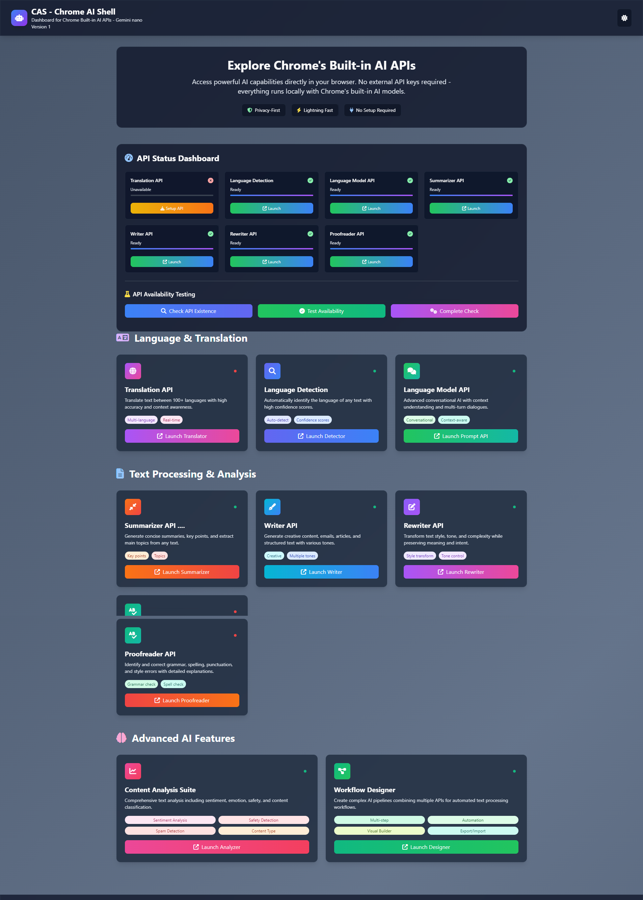

# Chrome AI Shell

Chrome AI Shell is a modern, user-friendly dashboard for exploring and testing Chrome's built-in AI APIs—including Gemini Nano, LanguageModel, Translator, and more. It provides a visual interface to check API availability, launch demo tools, and experiment with local AI features directly in your browser—no external API keys or cloud services required.

**What it does:**
- Displays real-time status of supported Chrome AI APIs
- Lets you launch and interact with demos for translation, summarization, rewriting, proofing, and more
- Supports light/dark themes and modular UI extensions
- Runs 100% locally—no backend, no data leaves your browser

**Technologies used:**
- HTML5 & JavaScript (Vanilla, no frameworks)
- Tailwind CSS (via CDN) for modern, responsive styling
- Chrome's built-in AI APIs (browser-native, no external dependencies)
- Static file serving (works with Python http.server, Node.js http-server, or any static host)

## Features
- **API Status Dashboard**: See availability of all supported Chrome AI APIs at a glance.
- **One-click Launch**: Open demo pages for translation, summarization, rewriting, proofing, and more.
- **Theme Support**: Toggle between light and dark mode.
- **Modular UI**: Easily extend with new APIs or features.
- **No Backend Required**: 100% static, works with any static file server.

## Getting Started

1. **Clone the repository:**
   ```sh
   git clone <your-repo-url>
   cd ChromeShell
   ```
2. **Serve the files locally:**
   - With Python:
     ```sh
     python -m http.server 8080
     ```
   - Or with Node.js:
     ```sh
     npx http-server -p 8080
     ```
3. **Open your browser:**
   Go to [http://localhost:8080](http://localhost:8080)

## Project Structure
- `index.html` — Main dashboard UI
- `app.js` — Main application logic
- `*.html` — Demo pages for each API (translator, summarizer, etc)
- `security.js` — Security and CSP logic
- `tailwindcss` — Used via CDN for styling

## Requirements
- Chrome 122+ (for built-in AI APIs)
- No build step required

## Security
- Aggressive Content Security Policy (CSP)
- No external scripts except Tailwind and FontAwesome
- No user data leaves your browser

## License
MIT

## Images




---

**Chrome AI Shell** is built for rapid prototyping and demoing Chrome's on-device AI features. Contributions welcome!
